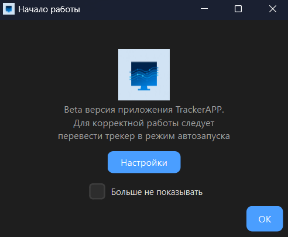
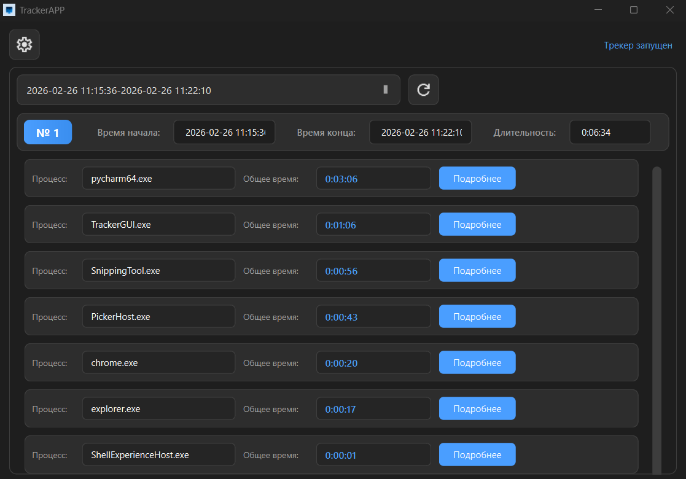
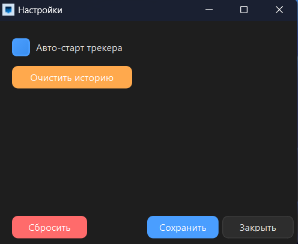

# 🖥 TrackerAPP Windows

**TrackerAPP Windows** — десктопное приложение для Windows, которое автоматически отслеживает активность пользователя в приложениях и собирает статистику использования.

Проект состоит из фонового трекера и отдельного графического интерфейса для просмотра данных.

## Скачать:
[](https://github.com/NoNameVD/TrackerAPP_Windows/releases/download/Beta/TrackerAPP-beta.rar)

---

## 🚀 Возможности

- 🔄 Автоматическое создание сессии при запуске системы
- 🖥 Отслеживание активного окна пользователя
- ⏱ Фиксация фокусов приложений (`start_time` / `end_time`)
- 📊 Подсчёт общего времени использования приложений
- 🗂 Группировка данных по сессиям (каждое включение ПК — новая сессия)
- 💾 Хранение данных в SQLite (`activity.db`)
- 🪶 Portable-версия (работает без установки)
- 🎨 Отдельный GUI для просмотра статистики

---

## 🏗 Архитектура проекта

```
TrackerGUI.exe   → Интерфейс просмотра статистики
tracker.exe      → Фоновый модуль сбора данных
activity.db      → База данных SQLite
configs/         → Конфигурационные файлы
icons/           → Ресурсы интерфейса
```

---

## 🗄 Структура базы данных

### Таблица `sessions`

| Поле | Описание |
|------|----------|
| `id` | ID сессии |
| `start_time` | Время начала сессии |
| `end_time` | Время окончания сессии |

### Таблица `activity`

| Поле | Описание |
|------|----------|
| `id` | ID записи |
| `session_id` | Связь с сессией |
| `process_name` | Имя процесса |
| `start_time` | Начало фокуса |
| `end_time` | Конец фокуса |

---

## ⚙ Как это работает

1. При запуске системы стартует `tracker.exe`
2. Создаётся новая сессия
3. Каждую секунду проверяется активное окно
4. При смене фокуса фиксируется интервал (`start` → `end`)
5. Данные сохраняются в SQLite
6. `TrackerGUI.exe` читает БД и отображает статистику

---

## ▶ Запуск

1. Убедитесь, что в одной папке находятся:
   - `tracker.exe`
   - `TrackerGUI.exe`
   - `activity.db`

2. Откройте `TrackerGUI.exe` для просмотра статистики.

> `tracker.exe` запускается автоматически при старте системы и работает в фоне.

---

## 🛠 Технологии

| Технология | Назначение |
|------------|------------|
| Python | Основной язык разработки |
| PySide6 | Графический интерфейс |
| SQLite3 | Хранение данных |
| PyInstaller | Сборка в исполняемые файлы |

## 📲 Интерфейс

### 1. Окно приветствия


### 2. Основное окно программы


### 3. Настройки


### 4. Дополнительная информация о процессе
